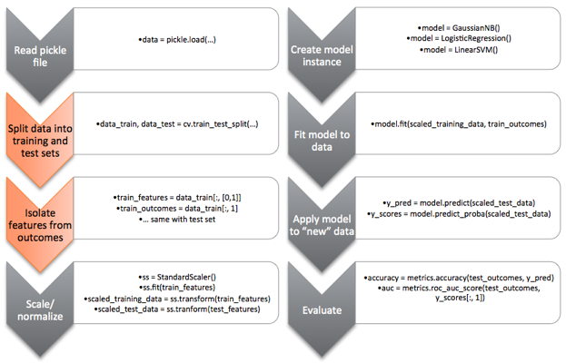

# Lab 8 - Random Forests #

Welcome to your final machine learning lab!  In this lab, you will be working
with an expanded dataset from the previous lab centered around congestive heart
failure.  There are more features included within this dataset, some
valuable and some not.

## Part 1 ##

For the first part of the assignment, you are encouraged to experiment with many
of the [feature selection
tools](http://scikit-learn.org/0.15/modules/classes.html#module-sklearn.feature_selection)
available within sklearn.  While we have only discussed feature selection at a
high level and played with PCA, these functions provide additional tools to aid
you in the feature selection process.

Some are focused purely on statistical measures (e.g. VarianceThreshold) while
others examine the actual training data (e.g. SelectKBest).  We had also briefly
discussed the RFE (recursive feature elimination) where you include the use of
an estimator such as an SVC (support vector classifier) to aid in the
elimination of unnecessary features.  

You may also consider taking a look at sklearn's [feature selection
documentation](http://scikit-learn.org/0.15/modules/feature_selection.html).

You are welcome to use as many or as few of the tools within sklearn's feature
selection module.  You will be using these in order to select out those features
that will aid you in classifying the CHF from non-CHF patients.  Be aware that
several of the features are completely randomly generated.

You will then feed selected features into a classifier of your choice (e.g.
logistic regression, gaussian naive bayes, or a support vector classifier).  As
with the last few labs, the purpose of this lab is not to grade you on specific
function implementations but your overall ability to take a set of data, extract
some useful features, and then attempt to classify the data.  

### Deliverables ###

For part 1, your deliverables will be the code you generate as well as a markdown
file detailing the features you selected and your justification.  If you used a
specific function within sklearn, please indicate why you chose that particular
function and associated parameters.  A valid reason is that you performed a
grid search which yielded that parameter as the best.

Please also include performance metrics for your classifier - you are welcome to
choose whichever metrics you see fit.  Please explain the significance of your
metrics and why you chose those specific metrics.

## Part 2 ##

For the second part of this lab, you will be using the same dataset but you will
now be using a random forest as your classifier.  You are welcome to use the
default values for the various parameters or you may tune them as you see fit.
You are also welcome to use a grid search to tune the parameters.

### Deliverables ###

For part 2, you will be submitting your code as well as adding to the markdown
file that you generated for part 1.  You will need to detail the final
parameters that you chose for the random forest classifier as well as basic
metrics.  I suggest that you use (at the least) the same metrics that you used
in part 1.  

Additionally, you will list the features based on their importance as
determined by the random forest.  Using this list, answer the following
question:

1. Which features are "most" important?  That is, based on your interpretation
   of the random forest output, would you choose to select only a subset of
   features if you were to use another model such as a support vector machine?

## General comments ##

Your final exam will a coding assignment very similar to this lab and you are
expected to complete it within the 2 hour timeframe.  During the last week of
this course, we will be reviewing this lab as a class and discussing various
approaches.  I will be sharing some of your code with the rest of the class and
providing an opportunity to discuss pros/cons and alternatives.

This lab is intended as an opportunity to bring together many of the concepts in
this course so you should be thinking about the overall analytics workflow as
you work through the lab.  

